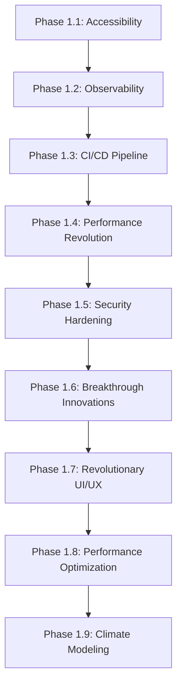

# 🏗️ Service Architecture Map

## Visual Service Dependencies & Integration Guide

### 🎯 Core Service Categories

#### **🔥 PHASE 1 COMPLETE - Production Foundation**



### **📦 Performance Optimization Stack (Phase 1.8)**
```
┌─────────────────────────────────────┐
│         Performance Layer          │
├─────────────────────────────────────┤
│ AdvancedBundleOptimizer            │
│ ├── .types.ts (interfaces)         │
│ ├── .core.ts (analysis logic)      │
│ └── .ts (service integration)      │
├─────────────────────────────────────┤
│ EnhancedMemoryManager              │
│ ├── .types.ts (memory interfaces)  │
│ ├── .core.ts (monitoring logic)    │
│ └── .ts (cleanup integration)      │
├─────────────────────────────────────┤
│ NetworkPerformanceOptimizer        │
│ ├── .types.ts (network interfaces) │
│ └── .ts (optimization service)     │
└─────────────────────────────────────┘
```

### **🌍 Climate Modeling Stack (Phase 1.9)**
```
┌─────────────────────────────────────┐
│         Climate Layer              │
├─────────────────────────────────────┤
│ ClimateModelingEngine              │
│ ├── .types.ts (climate interfaces) │
│ ├── .core.ts (prediction logic)    │
│ └── .ts (API integration)          │
│                                     │
│ External APIs:                      │
│ ├── NASA Climate Data API          │
│ ├── NOAA Weather API               │
│ └── Copernicus Climate Service     │
└─────────────────────────────────────┘
```

## 🔄 Service Dependency Matrix

### **High-Level Dependencies**
```
ObservabilityService ← 16+ services (Central hub)
├── CarbonAPIService
├── EnhancedPerformanceService  
├── SecurityMonitoringService
├── AdvancedBundleOptimizer
├── EnhancedMemoryManager
├── NetworkPerformanceOptimizer
├── ClimateModelingEngine
└── [10+ other services]
```

### **Core Service Interactions**
| Service | Depends On | Used By | Integration Level |
|---------|------------|---------|------------------|
| `ObservabilityService` | None | 16+ services | Central Hub |
| `CarbonTwinEngine` | ObservabilityService, MLCarbonPrediction | ComputerVisionCarbonEngine | High |
| `ClimateModelingEngine` | NetworkPerformanceOptimizer | CarbonAPIService | Medium |
| `EnhancedMemoryManager` | ObservabilityService | All services | Low (Monitoring) |
| `QuantumNeuralComputingEngine` | ObservabilityService, CarbonTwinEngine | MLCarbonPrediction | High |

### **🚨 Critical Integration Points**

#### **1. Performance Monitoring Chain**
```
User Action → EnhancedPerformanceService → ObservabilityService → Analytics
           ↓
    AdvancedBundleOptimizer (bundle analysis)
           ↓  
    EnhancedMemoryManager (memory monitoring)
           ↓
    NetworkPerformanceOptimizer (network optimization)
```

#### **2. Carbon Calculation Pipeline**
```
User Input → CarbonAPIService → MLCarbonPrediction → CarbonTwinEngine
          ↓                  ↓                    ↓
    ClimateModelingEngine   QuantumNeuralComputing   ComputerVisionCarbon
```

#### **3. Security & Monitoring**
```
All Services → ObservabilityService → SecurityMonitoringService
            ↓                      ↓
    Performance Metrics        Security Events
            ↓                      ↓
    EnhancedAnalyticsService   RuntimeSecurityService
```

## 🎯 Service Quality Standards

### **Modular Pattern (REQUIRED)**
```typescript
// 1. Types Definition (50-100 lines)
export interface ServiceNameConfig {
  readonly setting: string;
  readonly options: ServiceOptions;
}

// 2. Core Logic (200-300 lines)
export class ServiceNameCore {
  async processData(): Promise<Result> {
    // Core business logic
  }
}

// 3. Integration Layer (100-200 lines)  
class ServiceNameService {
  async publicMethod(): Promise<Result> {
    // Service integration
  }
}

export const serviceName = new ServiceNameService();
```

### **Required Integration Points**
✅ **ObservabilityService**: All services must track metrics  
✅ **Error Handling**: Comprehensive try-catch with observability  
✅ **TypeScript**: Strict typing with interfaces  
✅ **Mobile Optimization**: Battery and memory awareness  
✅ **Caching**: Intelligent caching where applicable  

## 🚀 Phase 2.0 Architecture Plan

### **State-of-the-Art Services (Pending)**
```
Phase 2.0: Advanced AI & Futuristic Features
├── AIConsciousnessEngine
│   ├── DecisionMakingCore
│   ├── SelfAwarenessTracker  
│   └── LearningAdaptationModule
├── MetaverseCarbonEcosystem
│   ├── VirtualEnvironmentEngine
│   ├── AvatarCarbonTracker
│   └── SocialMetaverseFeatures
├── QuantumCryptographyService
│   ├── QuantumKeyDistribution
│   └── QuantumResistantEncryption
└── NeurofeedbackOptimizer
    ├── BiometricInterfaceEngine
    ├── EmotionOptimizationCore
    └── PersonalizationModule
```

## 🔧 Development Guidelines

### **When Adding New Services**
1. **Check Dependencies**: Review this map before creating dependencies
2. **Follow Modular Pattern**: Always use 3-file structure (types, core, integration)
3. **Integration Testing**: Test with ObservabilityService integration
4. **Update This Map**: Add your service to the dependency matrix
5. **Performance Impact**: Consider mobile constraints

### **Service Naming Convention**
- **Core Business Logic**: `[Domain]APIService` (e.g., `CarbonAPIService`)
- **Enhancement Layer**: `Enhanced[Domain]Service` (e.g., `EnhancedSecurityService`)
- **Processing Engine**: `[Purpose]Engine` (e.g., `ClimateModelingEngine`)
- **Optimization**: `[Type]Optimizer` (e.g., `NetworkPerformanceOptimizer`)

### **Integration Checklist**
- [ ] Implements ObservabilityService tracking
- [ ] Follows modular pattern (types/core/integration)
- [ ] Includes comprehensive error handling
- [ ] Mobile performance optimized
- [ ] TypeScript strict compliance
- [ ] Proper dependency injection
- [ ] Cache strategy implemented (if applicable)
- [ ] Tests cover all modules

---

**🎯 Use this map to understand service relationships and plan new integrations effectively!**