# Kindred Architecture Documentation

## System Architecture Overview

Kindred follows a **Service-Oriented Architecture (SOA)** with **Redux-based state management** and
**Firebase-powered backend services**. The application is built using modern React Native patterns
with TypeScript for type safety and comprehensive testing coverage.

## High-Level Architecture Diagram

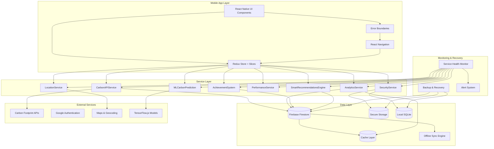

## Core Architecture Patterns

### 1. **Service-Oriented Architecture (SOA)**

Each major feature domain has a dedicated service with clear responsibilities:

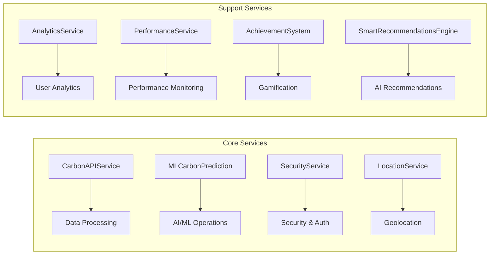

### 2. **Redux Slice Pattern**

State management follows the Redux Toolkit slice pattern with clear separation:

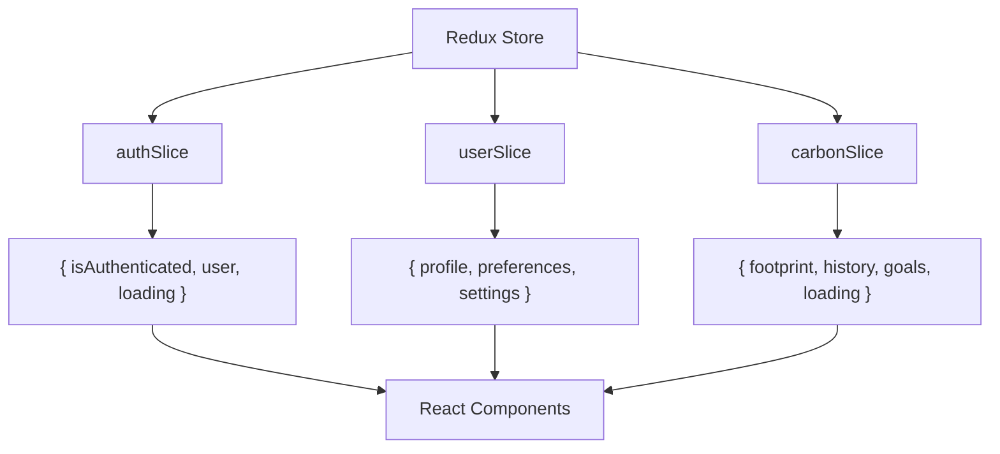

### 3. **Component Architecture**

Components follow a hierarchical structure with clear data flow:

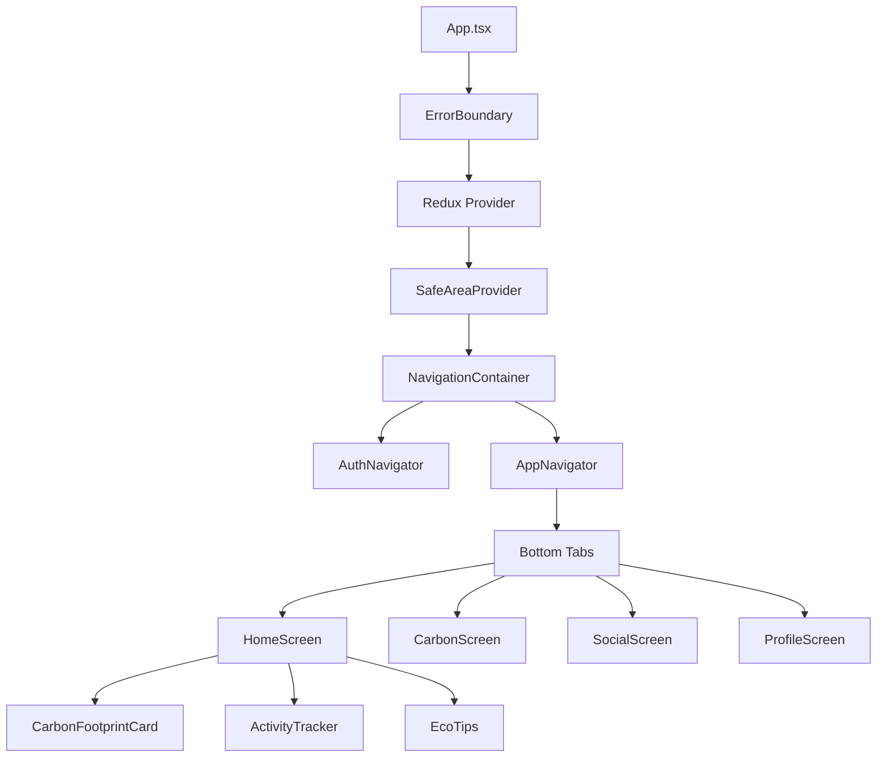

## Data Flow Architecture

### 1. **Carbon Tracking Data Flow**

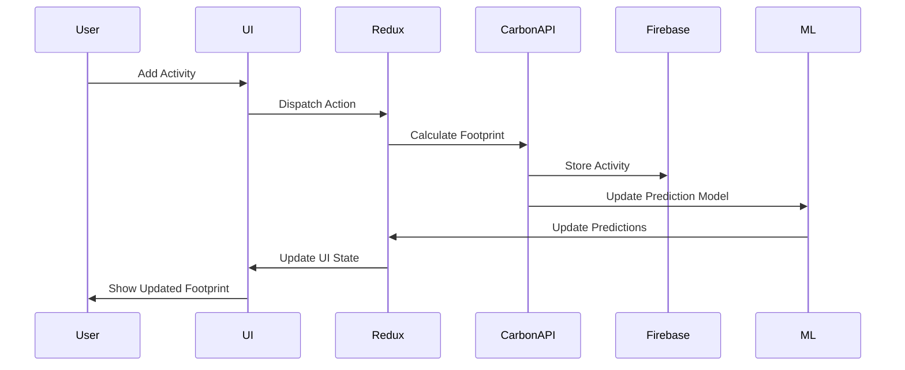

### 2. **Authentication Flow**

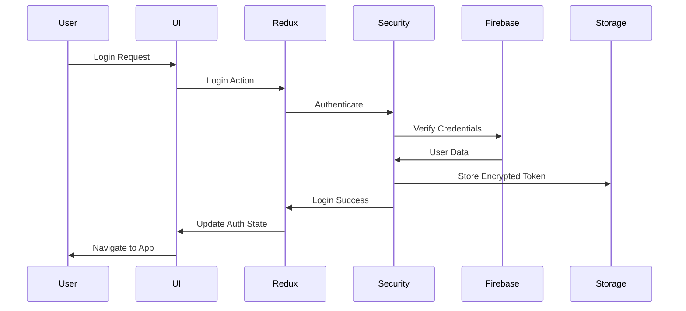

### 3. **Performance Monitoring Flow**

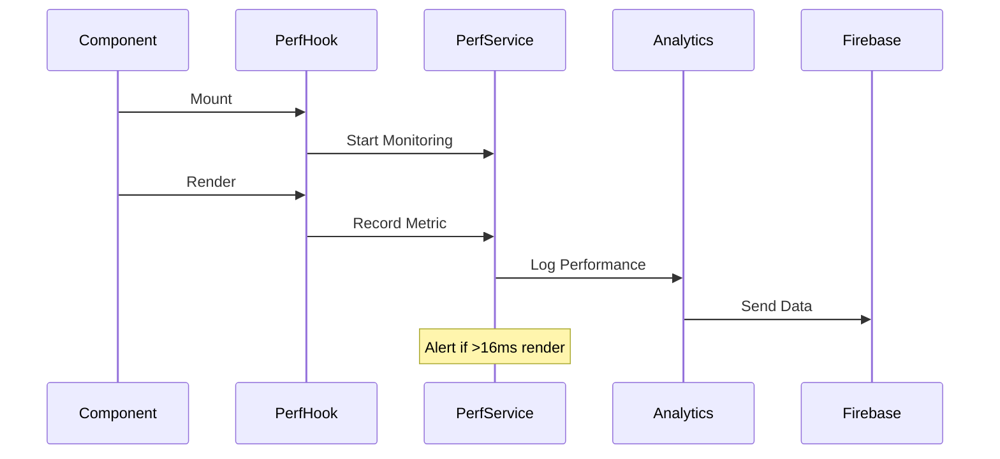

## Service Architecture Details

### 1. **CarbonAPIService Architecture**

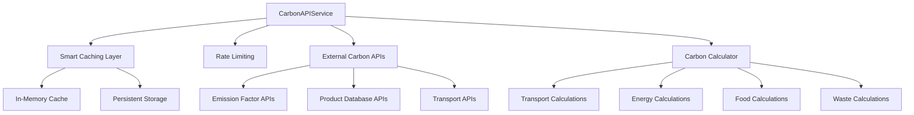

**Key Features:**

- **Smart Caching**: TTL-based caching with different lifetimes per data type
- **Rate Limiting**: 100 requests/minute with exponential backoff
- **Batch Processing**: Efficient bulk calculations
- **Regional Support**: Location-based emission factors
- **Error Handling**: Graceful degradation with cached fallbacks

### 2. **ML Architecture (TensorFlow.js)**

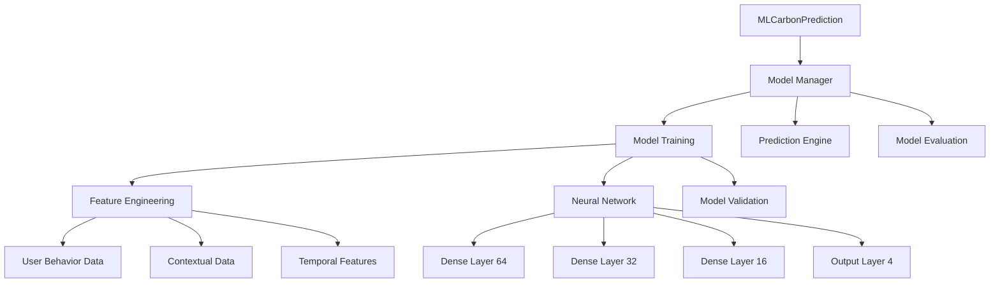

**Neural Network Architecture:**

- **Input Layer**: 25+ features (user behavior, context, temporal)
- **Hidden Layers**: 64 → 32 → 16 neurons with dropout regularization
- **Output Layer**: 4 categories (transport, energy, food, waste)
- **Optimization**: Adam optimizer with learning rate scheduling
- **Training**: Continuous learning from user interactions

### 3. **Security Architecture**

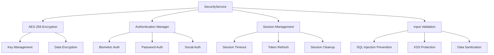

**Security Features:**

- **256-bit AES encryption** for sensitive data
- **Biometric authentication** with fallback options
- **Session management** with 30-minute timeout
- **Brute force protection** with login attempt limiting
- **Input validation** preventing injection attacks

### 4. **Performance Monitoring Architecture**

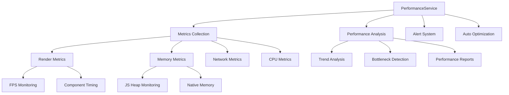

**Performance Features:**

- **Real-time monitoring** with < 100ms overhead
- **60fps tracking** with 16ms render threshold alerts
- **Memory leak detection** with automatic cleanup
- **Network performance** analysis with timeout detection
- **Automated optimization** suggestions

## Testing Architecture

### 1. **Testing Pyramid**

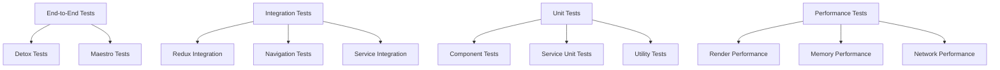

### 2. **Test Coverage Strategy**

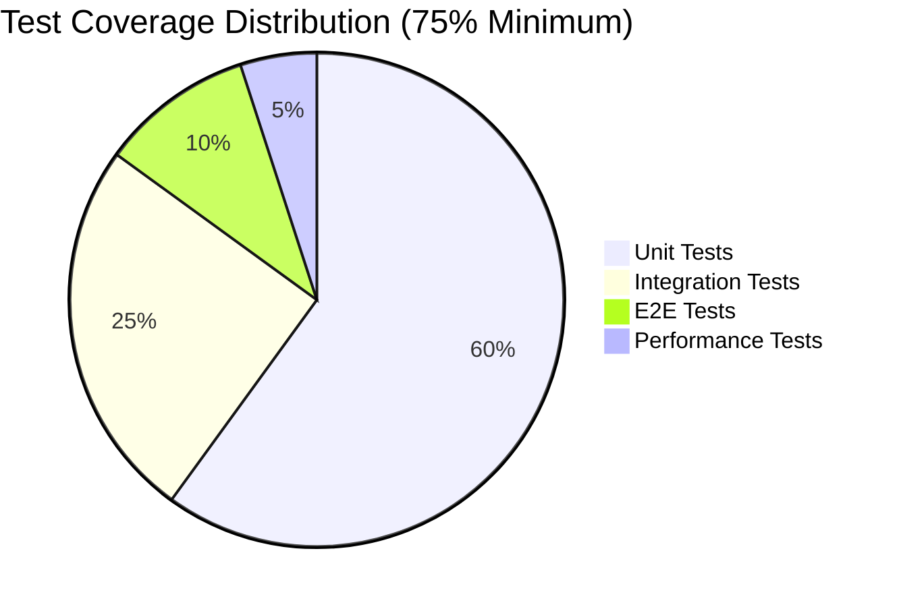

## Deployment Architecture

### 1. **Build Pipeline**

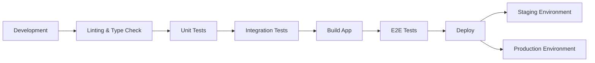

### 2. **Environment Configuration**

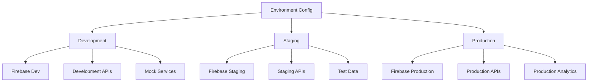

## Scalability Considerations

### 1. **Horizontal Scaling**

- **Service isolation** allows independent scaling
- **Caching strategies** reduce external API dependencies
- **Database sharding** potential for user data
- **CDN integration** for static assets

### 2. **Performance Optimization**

- **Bundle splitting** for faster initial load
- **Lazy loading** for non-critical components
- **Image optimization** with progressive loading
- **Background sync** for offline capabilities

### 3. **Monitoring & Observability**

- **Real-time performance monitoring** with Firebase
- **Error tracking** with comprehensive logging
- **User analytics** for feature usage insights
- **Business metrics** for sustainability impact

## Security Architecture

### 1. **Data Protection**

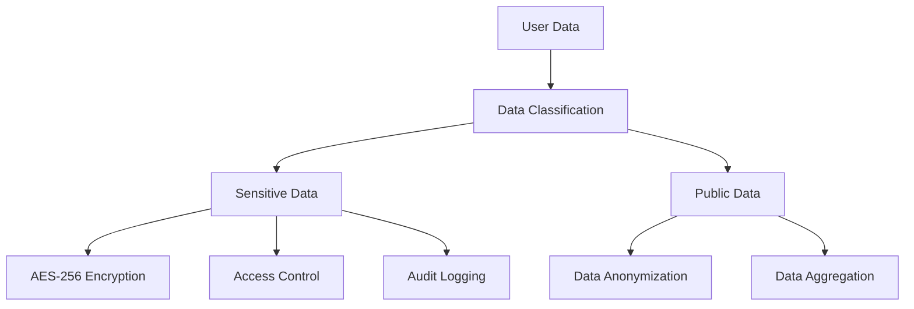

### 2. **Authentication & Authorization**

- **Multi-factor authentication** with biometric options
- **Role-based access control** for admin features
- **Session management** with secure token handling
- **OAuth integration** with Google Sign-In

### 3. **Privacy Compliance**

- **GDPR compliance** with data portability
- **Data minimization** principles
- **User consent management**
- **Right to deletion** implementation

## Error Handling & Recovery Architecture

### 1. **Service Failure Cascade Management**

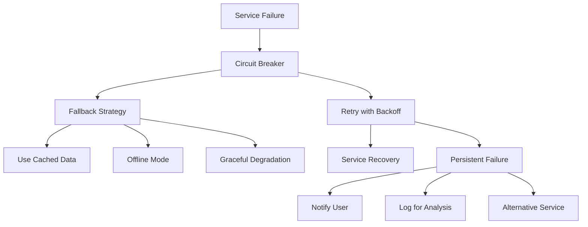

### 2. **Security Flow Architecture**

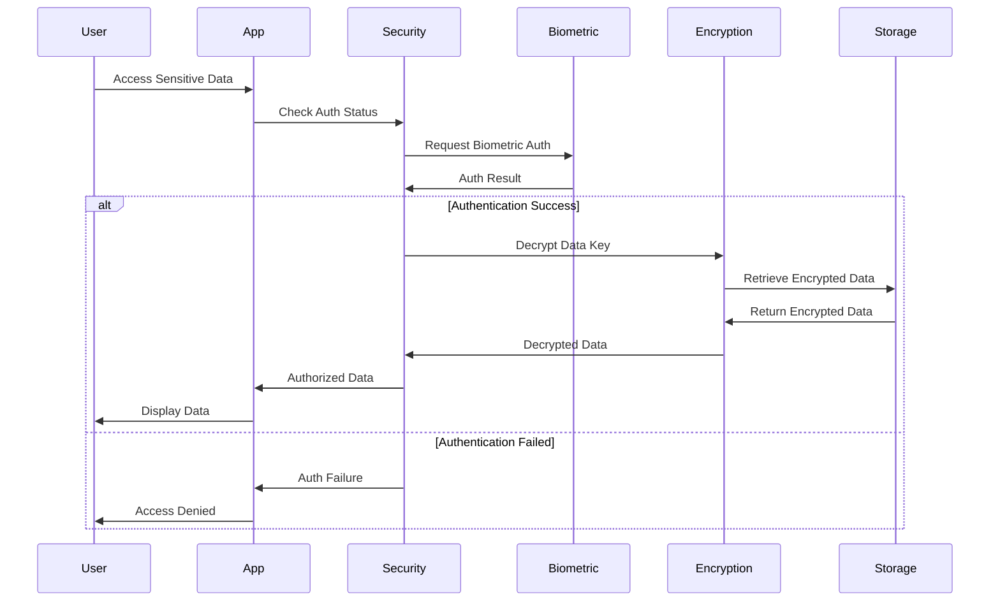

### 3. **Offline-First Data Sync Architecture**

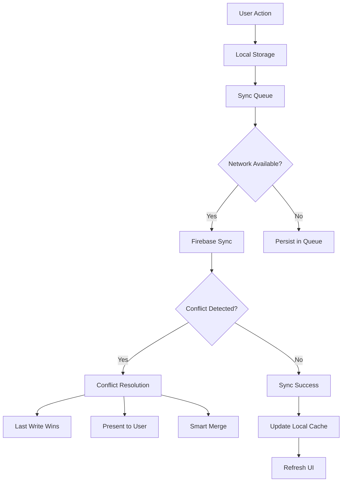

## API Contracts & Interfaces

### 1. **Service Interface Standards**

```typescript
// Standard Service Interface
interface Service {
  // Health check
  isHealthy(): Promise<boolean>;

  // Initialize service
  initialize(config: ServiceConfig): Promise<void>;

  // Cleanup resources
  cleanup(): Promise<void>;

  // Handle errors gracefully
  handleError(error: Error): ServiceErrorResponse;

  // Get service metrics
  getMetrics(): ServiceMetrics;
}

// Performance tracking for all services
interface PerformanceTracked {
  startTrace(name: string): void;
  stopTrace(name: string): void;
  recordMetric(name: string, value: number): void;
}
```

### 2. **Carbon API Service Contract**

```typescript
interface CarbonAPIInterface {
  calculateEmissions(data: ActivityData): Promise<CarbonFootprint>;
  getEmissionFactors(region: string): Promise<EmissionFactors>;
  batchCalculate(activities: ActivityData[]): Promise<CarbonFootprint[]>;

  // Error handling
  fallbackCalculation(data: ActivityData): CarbonFootprint;
  validateInput(data: ActivityData): ValidationResult;
}
```

### 3. **Security Service Contract**

```typescript
interface SecurityServiceInterface {
  encrypt(data: string, key?: string): Promise<EncryptedData>;
  decrypt(encryptedData: EncryptedData): Promise<string>;
  secureStore(key: string, value: any): Promise<void>;
  secureRetrieve(key: string): Promise<any>;

  // Session management
  createSession(user: User): Promise<Session>;
  validateSession(sessionId: string): Promise<boolean>;
  refreshSession(sessionId: string): Promise<Session>;
}
```

## Disaster Recovery & Backup Strategy

### 1. **Data Backup Architecture**

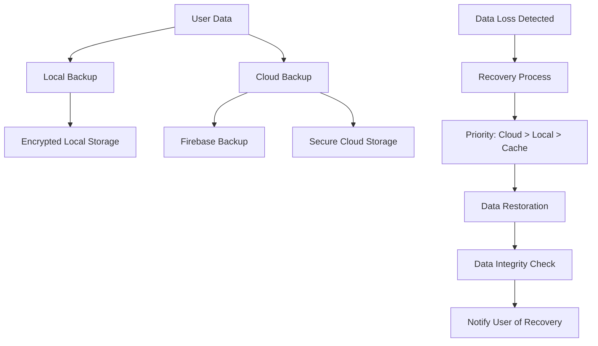

### 2. **Service Health Monitoring**

```mermaid
graph LR
  HEALTH_MONITOR[Service Health Monitor] --> SERVICE_CHECK[Periodic Health Checks]
  SERVICE_CHECK --> RESPONSE_TIME[Response Time Check]
  SERVICE_CHECK --> ERROR_RATE[Error Rate Monitoring]
  SERVICE_CHECK --> RESOURCE_USAGE[Resource Usage Check]

  RESPONSE_TIME --> ALERT_SLOW[Alert: Slow Response]
  ERROR_RATE --> ALERT_ERRORS[Alert: High Error Rate]
  RESOURCE_USAGE --> ALERT_MEMORY[Alert: Memory Usage]

  ALERT_SLOW --> AUTO_RECOVERY[Automatic Recovery]
  ALERT_ERRORS --> SERVICE_RESTART[Service Restart]
  ALERT_MEMORY --> MEMORY_CLEANUP[Memory Cleanup]
```

### 3. **Performance Budget Enforcement**

| Service            | Response Time Budget | Memory Budget | Error Rate Budget |
| ------------------ | -------------------- | ------------- | ----------------- |
| CarbonAPIService   | < 200ms              | < 20MB        | < 0.1%            |
| MLCarbonPrediction | < 500ms              | < 50MB        | < 0.5%            |
| SecurityService    | < 100ms              | < 10MB        | < 0.01%           |
| LocationService    | < 150ms              | < 15MB        | < 0.2%            |
| PerformanceService | < 50ms               | < 5MB         | < 0.05%           |

### 4. **Alerting & Escalation**

```mermaid
graph TD
  THRESHOLD_EXCEEDED[Performance Threshold Exceeded] --> LEVEL_1[Level 1: Log Warning]
  LEVEL_1 --> CONTINUE_MONITORING[Continue Monitoring]

  PERSISTENT_ISSUE[Issue Persists > 5min] --> LEVEL_2[Level 2: User Notification]
  LEVEL_2 --> GRACEFUL_DEGRADATION[Enable Graceful Degradation]

  CRITICAL_FAILURE[Critical Failure] --> LEVEL_3[Level 3: Emergency Mode]
  LEVEL_3 --> OFFLINE_MODE[Switch to Offline Mode]
  LEVEL_3 --> ANALYTICS_ALERT[Send Analytics Alert]
  LEVEL_3 --> RECOVERY_ATTEMPT[Attempt Auto-Recovery]
```

---

This enhanced architecture provides a robust, fault-tolerant foundation for the Kindred
sustainability tracking application, with comprehensive error handling, disaster recovery, and
monitoring capabilities that ensure high availability and excellent user experience even under
adverse conditions.
